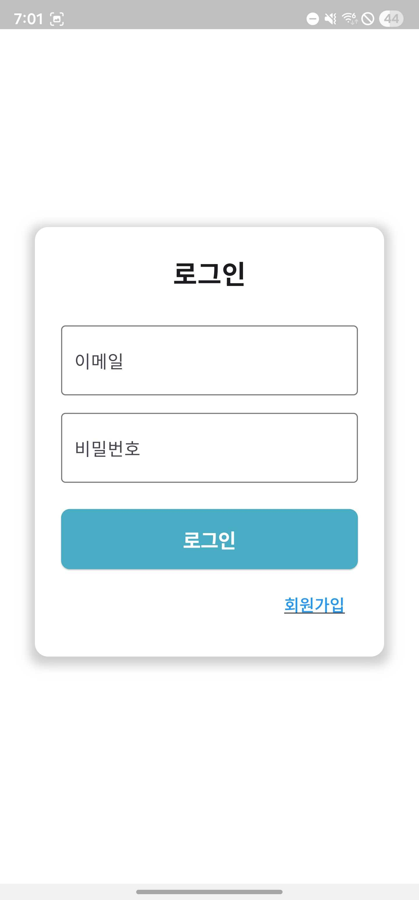
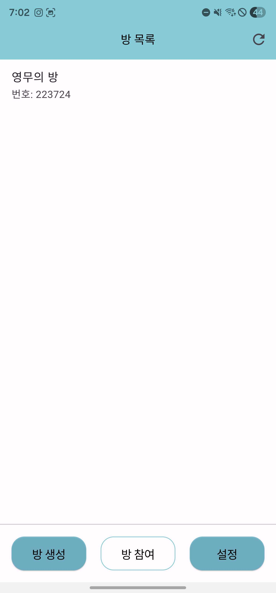
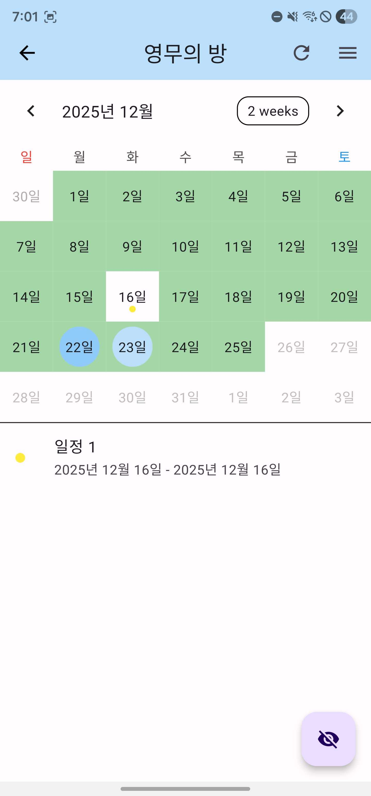
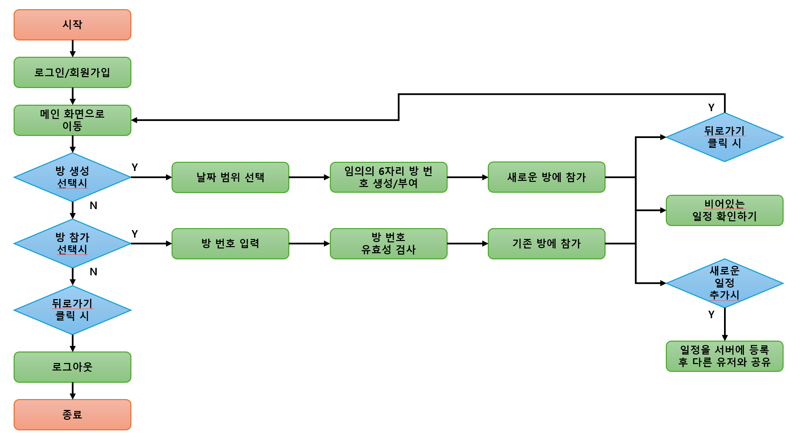

# 공유 캘린더 "이때어때"

## 프로젝트 개요
친구들과 약속을 정할 때, 팀원들과 회의 일정을 정할 때 모든 인원의 일정을 확인하고 빈 날짜를 찾는 과정은 복잡하다. 이때 캘린더에 등록된 각각의 일정을 확인하고, 모든 인원의 일정이 없는 날짜를 자동으로 찾아준다면 일정을 조율할 때 훨씬 편리할 것이다. 이를 위해 여러 인원이 함께 사용하는 공유 캘린더 프로젝트를 개발하였다.

일정을 정할 인원들끼리 모여 방을 생성할 수 있다. 각각의 방은 데이터가 독립적으로 저장되며, 한 방에 최대 6명의 인원까지 참여할 수 있다. 각각의 방에 참여한 인원들은 자신의 일정을 캘린더에 등록할 수 있다. 모든 인원이 일정을 등록한 후 버튼을 누르면 빈 날짜를 강조해서 표시해 준다. 각 인원이 어떠한 날에 일정이 있는지 확인할 수 있기 때문에 빈 날짜가 없더라도 일정 조율에 도움을 줄 수 있다.

## 사용한 기술 스택
- **클라이언트**: Flutter/Dart, FullCalendar(UI/UX 라이브러리)
- **서버**: Firebase Authentication(로그인 기능), Firebase Firebase(데이터베이스)

## 실행방법
우측 Releases 탭에서 APK 다운로드 후 실행

## 실행화면
| 로그인 화면 | 방 선택 화면 | 캘린더 화면 |
| :---: | :---: | :---: |
|  |  |  |

## 흐름도
